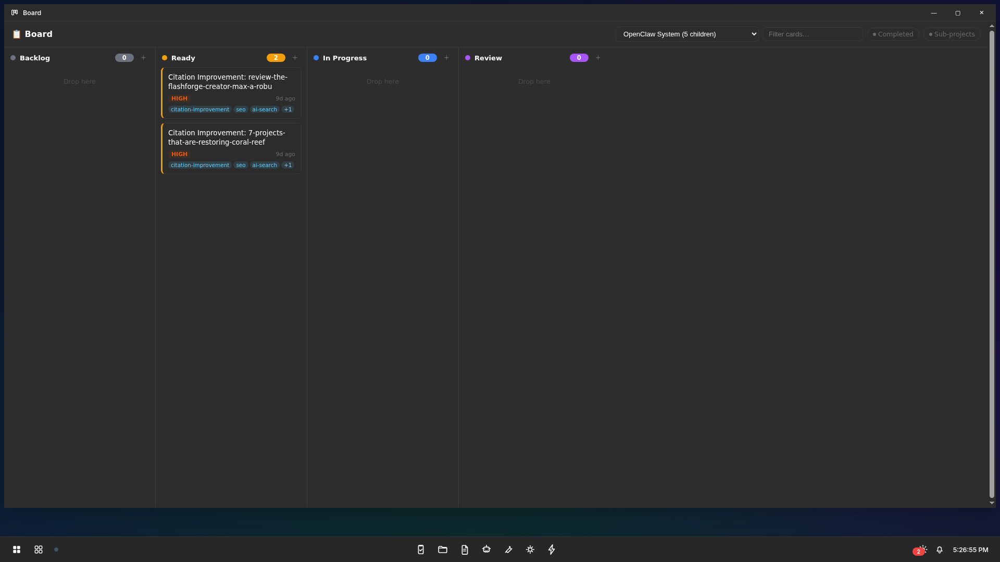
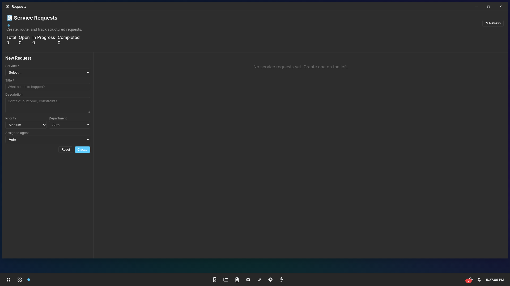
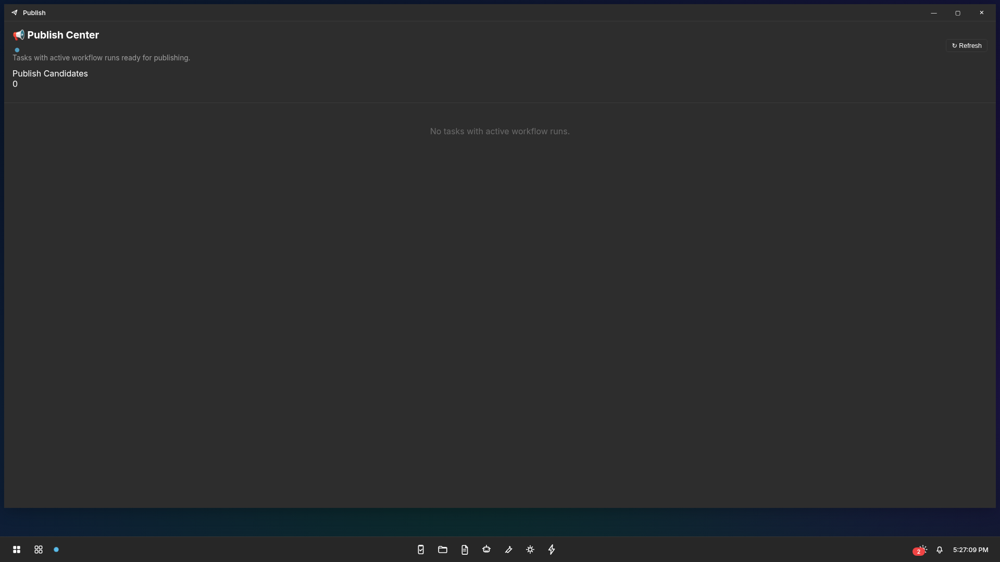
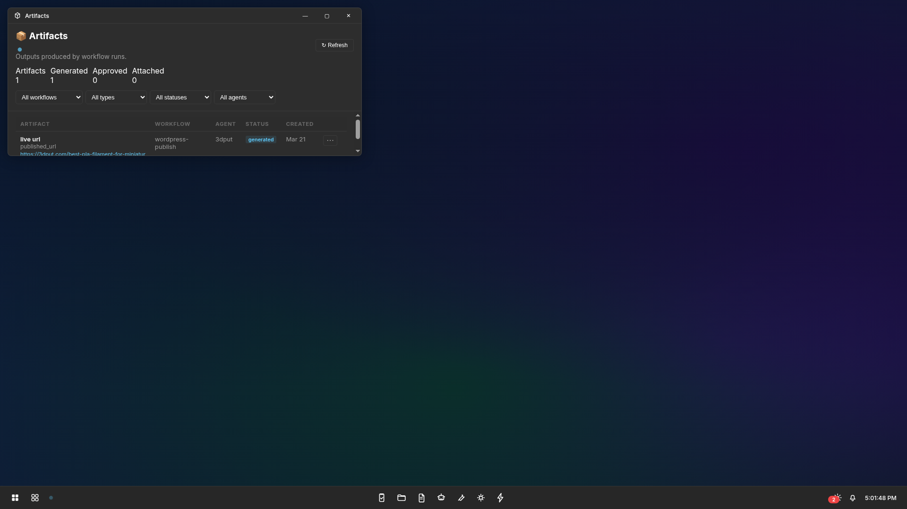
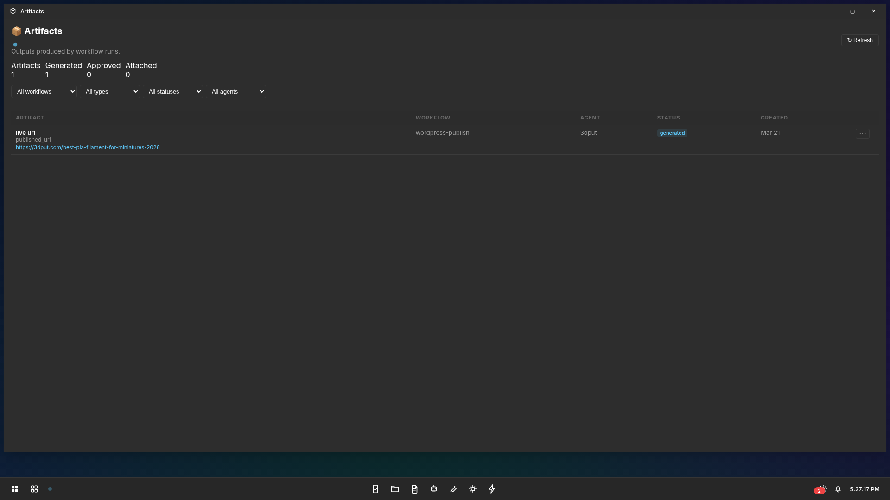
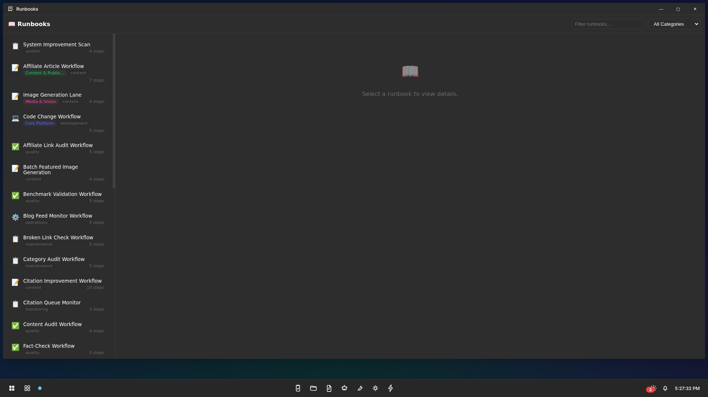
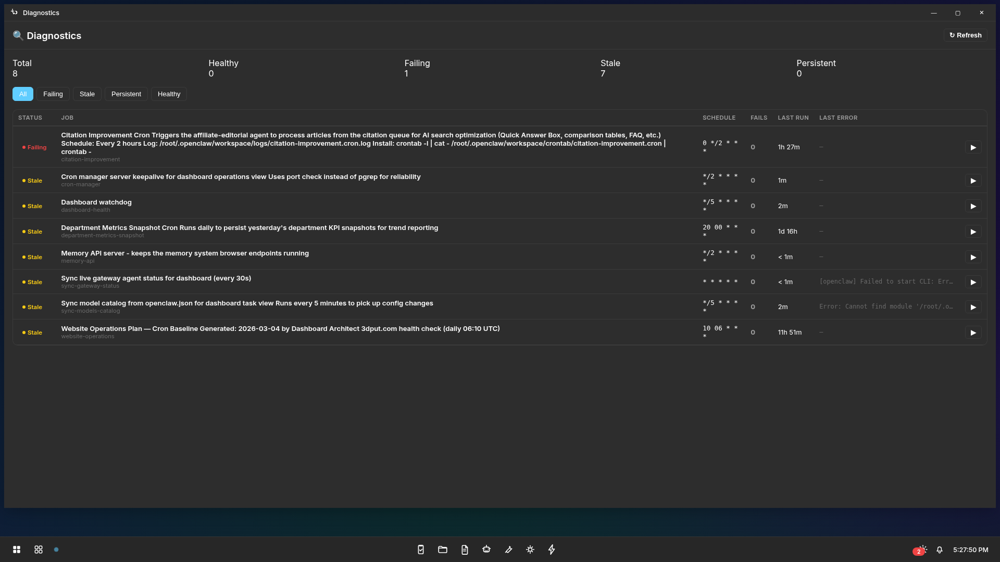
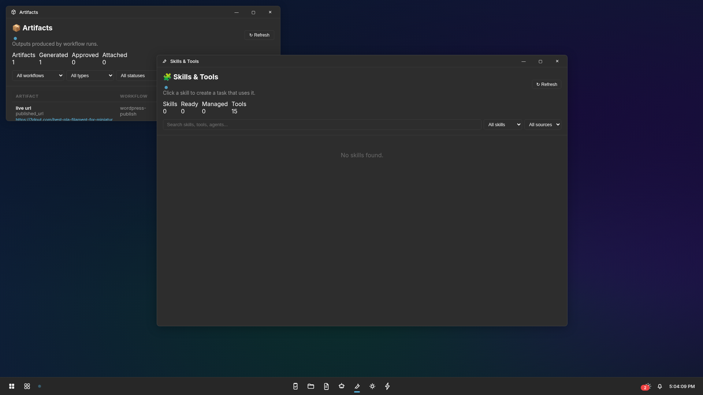
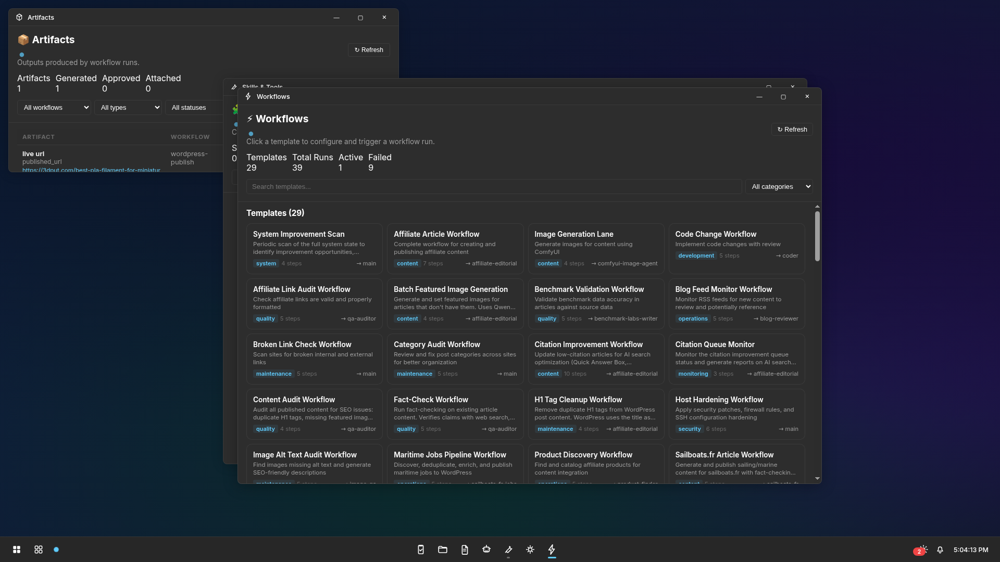
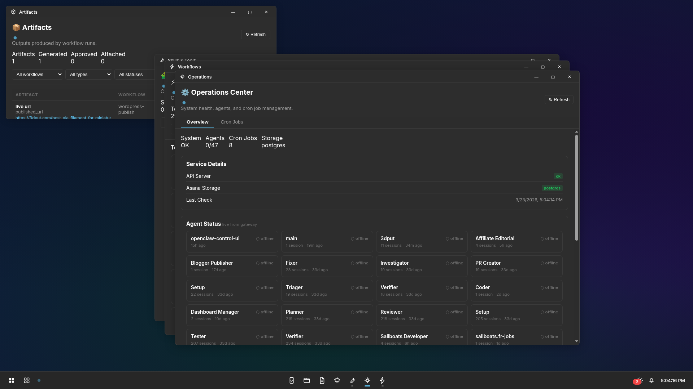

# OpenClaw Project WebOS

`2.0.0-rc.2`

A Windows 11-style desktop environment for managing OpenClaw agent workflows — served entirely in the browser with vanilla JS, no frameworks, no build step. Each feature is a windowed application launched from the taskbar or start menu.

## Screenshots

### Desktop

<p align="center">
  
</p>

### Work

| Tasks | Board | Timeline | Agents |
|:-----:|:-----:|:--------:|:------:|
|  |  |  |  |

| Requests | Publish | Approvals | Artifacts |
|:--------:|:-------:|:---------:|:---------:|
|  |  |  |  |

### Operations

| Dependencies | Health | Metrics | Runbooks |
|:------------:|:------:|:-------:|:--------:|
|  |  |  |  |

| Memory | Handoffs | Audit | Cron |
|:------:|:--------:|:-----:|:----:|
|  |  |  |  |

### System

| Diagnostics | Departments | Explorer | Notepad |
|:-----------:|:-----------:|:--------:|:-------:|
|  |  |  |  |

### Integration

| Skills & Tools | Workflows | Operations |
|:--------------:|:---------:|:----------:|
|  |  |  |

## Features

### Desktop Shell
- **Windows 11 aesthetic** — frosted glass taskbar, start menu with app grid, draggable/resizable windows
- **27 windowed apps** — each feature is a self-contained view launched as a desktop window
- **Start menu** — searchable app grid organized by category (Work, Operations, System, Integration)
- **Taskbar** — live clock, system tray, running app indicators

### Explorer (New)
File explorer window for browsing the OpenClaw workspace directly from the desktop. Features:

- **Quick-access roots** — one-click navigation to Backend, Dashboard, Extensions, Agents, and Docs directories
- **Breadcrumb navigation** — click any path segment to jump up the tree
- **File listing** — shows name, size, and modified time with folder/file icon differentiation
- **Directory browsing** — click any folder to descend; click breadcrumbs to ascend
- **Notepad integration** — double-click a file to open it in the Notepad app via the `notepad:open-file` event bridge
- **Filesystem API backend** — connects to `/api/fs` endpoint with path traversal protection and CORS support
- **Responsive tree** — adapts to the available window size

### Notepad (New)
Lightweight text editor window for viewing and editing files from the Explorer or standalone. Features:

- **File open from Explorer** — Explorer dispatches `notepad:open-file` events; Notepad listens and loads the content
- **Syntax-aware display** — renders file content with basic formatting and line structure
- **Direct path input** — open any workspace file by typing its path
- **State bridge** — supports `stateStore.setState()` for cross-view communication via the shell's view-state system
- **Clean editing surface** — minimal UI, maximum content area, appropriate for quick edits and reviews

### Task Management
- **Hierarchical boards** — parent/child project boards with folder-style navigation
- **Kanban board** — drag-and-drop columns (Ready, In Progress, Review, Completed)
- **Rich task composer** — agent assignment, preferred LLM model, priority, recurrence, start/due dates
- **Timeline view** — Gantt-style visualization of task scheduling and dependencies
- **Agent queue visibility** — live status of what each agent is working on

### Workflow Engine
- **Workflow dispatcher v2** — async agent-aware dispatch with system event bridge and heartbeat flow
- **Workflow runs API** — full CRUD for workflow executions with error details and agent routing
- **Runbook execution** — pre-defined operational procedures that agents can follow

### Observability
- **Agent dashboard** — live OpenClaw agent status, queue presence, per-agent detail
- **Health monitoring** — service health checks with status indicators
- **Metrics** — department-level and project-level metrics with sparkline widgets
- **Audit trail** — full audit log of actions, approvals, and state changes
- **Cron management** — view and manage scheduled jobs across the system

### Agent Integration
- **Agent reporter CLI** — agents create/complete/block tasks in real-time via `agent_reporter.py`
- **Bridge endpoints** — `GET /api/task-options`, `GET /api/agents/status`, `POST /api/agents/heartbeat`
- **OpenClaw-aware routing** — auto-detects workspace path, config, and binary location

## Install

Two install modes:

- **OpenClaw workspace install:** [docs/install-openclaw.md](docs/install-openclaw.md)
- **Standalone install:** [docs/install-standalone.md](docs/install-standalone.md)

Quick start (OpenClaw workspace):

```bash
git clone https://github.com/pgedeon/openclaw-project-webos.git ~/.openclaw/workspace/dashboard
cd ~/.openclaw/workspace/dashboard
npm install
cp .env.example .env
psql -U openclaw -d openclaw_dashboard -f schema/openclaw-dashboard.sql
npm start
```

When installed at `~/.openclaw/workspace/dashboard`, the server auto-detects the workspace path. Set `OPENCLAW_WORKSPACE` and `OPENCLAW_CONFIG_FILE` if installing elsewhere.

## Repository Layout

```
├── index.html                  # Desktop shell entry point
├── task-server.js              # API server (tasks, workflows, agents, filesystem)
├── filesystem-api-server.mjs   # Filesystem browser API with CORS + path protection
├── gateway-workflow-dispatcher-v2.js  # Async workflow dispatch v2
├── gateway-workflow-dispatcher.js     # Legacy workflow dispatcher
├── storage/
│   └── asana.js                # PostgreSQL storage layer
├── src/
│   ├── shell/
│   │   ├── shell-main.mjs      # Desktop shell controller
│   │   ├── app-registry.mjs    # 27-app window registry
│   │   ├── window-manager.mjs  # Draggable/resizable window manager
│   │   ├── start-menu.mjs      # Start menu with app grid
│   │   ├── taskbar.mjs         # Bottom taskbar with clock + system tray
│   │   ├── widgets/            # Desktop widgets (clock, health, pulse, etc.)
│   │   └── native-views/       # All 27 window view implementations
│   │       ├── explorer-view.mjs   # File explorer (new)
│   │       ├── notepad-view.mjs    # Text editor (new)
│   │       ├── tasks-view.mjs
│   │       ├── board-view.mjs
│   │       ├── agents-view.mjs
│   │       └── ...
│   ├── styles/                 # Win11-themed CSS (shell, taskbar, windows, widgets)
│   └── offline/                # IndexedDB offline state management
├── schema/
│   ├── openclaw-dashboard.sql  # Main schema
│   └── migrations/             # 21 incremental migrations
├── scripts/
│   ├── dashboard-health.sh
│   ├── dashboard-validation.js
│   ├── restart-task-server.sh
│   └── smoke-test-dashboard.sh
├── tests/                      # Unit + integration tests
├── docs/
│   ├── admin-guide.md
│   ├── development.md
│   ├── install-openclaw.md
│   ├── install-standalone.md
│   ├── user-guide.md
│   └── screenshots/all-windows/  # All window screenshots
├── runbooks/                   # Operational runbook definitions
└── .env.example                # Environment variable template
```

## Configuration

See [.env.example](.env.example) for supported environment variables.

Key variables:
- `PORT` — server port (default 3876)
- `STORAGE_TYPE` — `postgres` or `json_snapshot`
- `POSTGRES_HOST`, `POSTGRES_PORT`, `POSTGRES_DB`, `POSTGRES_USER`, `POSTGRES_PASSWORD`
- `OPENCLAW_WORKSPACE` — path to OpenClaw workspace root
- `OPENCLAW_CONFIG_FILE` — path to openclaw.json
- `OPENCLAW_BIN` — path to openclaw binary
- `FILESYSTEM_API_PORT` — port for the filesystem API server (default 3880)

## Development

```bash
npm install
npm run validate
```

Point validation at a custom port:
```bash
DASHBOARD_API_BASE=http://localhost:3887 node scripts/dashboard-validation.js
```

## Release

Tagged as `v2.0.0-rc.2` on [github.com/pgedeon/openclaw-project-webos](https://github.com/pgedeon/openclaw-project-webos).

- Release notes: [RELEASE.md](RELEASE.md)
- Change history: [CHANGELOG.md](CHANGELOG.md)

## License

MIT. See [LICENSE](LICENSE).
