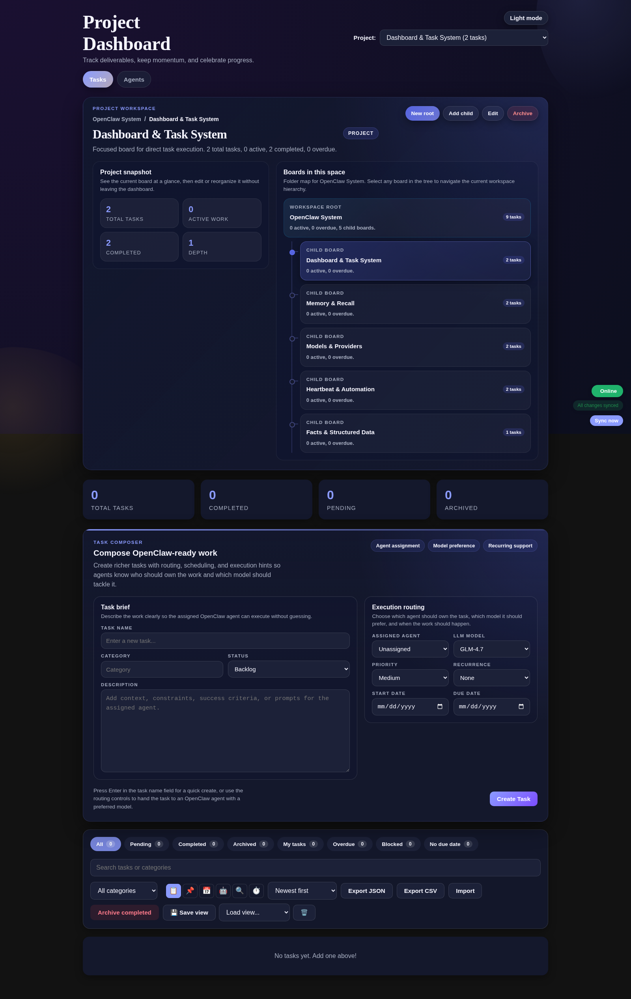
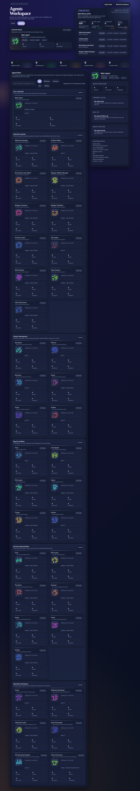

# OpenClaw Project Dashboard

`2.0.0-rc.2`

Operations-first project dashboard for OpenClaw. Win11-style desktop shell with hierarchical Kanban boards, agent-aware task routing, workflow engine, widget system, cron monitoring, and audit trails — all wired into the OpenClaw runtime.

## Screenshots

### Desktop Shell — Board View

<p align="center">
  
</p>

### Desktop Shell — Agents

<p align="center">
  
</p>

## Features

**Desktop Shell**
- Win11-style taskbar, start menu, and draggable windows
- Widget panel with system health, cron countdowns, error feed, and more
- Real-time sync via WebSocket with offline support (IndexedDB)

**Kanban Board**
- Hierarchical folder-style projects with parent and child boards
- Rich task composer: agent assignment, priority, recurrence, dates, tags
- Drag-and-drop columns, subtask expansion, live stats

**Workflow Engine**
- Template-based workflow runs with queue, start, and completion tracking
- Blocker classification, business context, and delivery status
- Artifact storage and approval gates

**Operations Center**
- System health overview with live agent status from the OpenClaw gateway
- Cron job management with inline log viewing and run triggers
- Agent fleet monitoring with session counts and last-seen timestamps

**Agent Integration**
- OpenClaw bridge endpoints for bidirectional agent ↔ dashboard communication
- Agents report work to the Kanban board via `agent_reporter.py`
- Heartbeat system with cron monitoring and failure escalation

**Security**
- Secret scanning and redaction pipeline (`src/security/`)
- QMD security module for workspace data protection
- Environment-driven config — no hardcoded credentials

## Install

```bash
git clone https://github.com/pgedeon/openclaw-project-webos.git
cd openclaw-project-webos
npm install
cp .env.example .env
# Edit .env with your PostgreSQL credentials
psql -U openclaw -d mission_control -f schema/openclaw-dashboard.sql
npm start
```

See [docs/install-openclaw.md](docs/install-openclaw.md) and [docs/install-standalone.md](docs/install-standalone.md) for detailed setup.

When installed at `~/.openclaw/workspace/dashboard`, the server auto-detects the workspace path. Set `OPENCLAW_WORKSPACE` and `OPENCLAW_CONFIG_FILE` for custom paths.

## Configuration

See [.env.example](.env.example) for supported environment variables:

| Variable | Description | Default |
|----------|-------------|---------|
| `PORT` | API server port | `3876` |
| `STORAGE_TYPE` | `postgres` or `memory` | `postgres` |
| `POSTGRES_HOST` | Database host | `127.0.0.1` |
| `POSTGRES_PORT` | Database port | `5432` |
| `POSTGRES_DB` | Database name | `mission_control` |
| `POSTGRES_USER` | Database user | `postgres` |
| `POSTGRES_PASSWORD` | Database password | — |
| `OPENCLAW_WORKSPACE` | OpenClaw workspace path | auto-detected |
| `OPENCLAW_CONFIG_FILE` | OpenClaw config path | auto-detected |
| `OPENCLAW_BIN` | Path to openclaw binary | `openclaw` |

## Architecture

```
┌─────────────────────────────────────────────┐
│              Browser (WebOS Shell)           │
│  ┌──────┐ ┌───────┐ ┌────────┐ ┌────────┐ │
│  │Board │ │Agents │ │Workflows│ │Ops Ctr │ │
│  └──┬───┘ └───┬───┘ └───┬────┘ └───┬────┘ │
│     └─────────┴──────────┴──────────┘      │
│                   │ REST + WebSocket        │
├───────────────────┼─────────────────────────┤
│           task-server.js (:3876)            │
│  ┌─────────┐ ┌──────────┐ ┌─────────────┐  │
│  │Tasks API│ │Workflows │ │Metrics API  │  │
│  └────┬────┘ └────┬─────┘ └──────┬──────┘  │
│       └───────────┼───────────────┘         │
│                   │                         │
│  ┌────────────────▼──────────────────────┐  │
│  │        PostgreSQL (mission_control)    │  │
│  └───────────────────────────────────────┘  │
├─────────────────────────────────────────────┤
│  cron-manager-server.mjs (:3878)            │
│  memory-api-server.mjs (:3879)              │
│  gateway-sync, workflow-dispatcher           │
└─────────────────────────────────────────────┘
```

## Repository Layout

```
├── task-server.js              # Main API server
├── cron-manager-server.mjs     # Cron job management API
├── memory-api-server.mjs       # Memory system endpoints
├── gateway-workflow-dispatcher.js
├── workflow-run-monitor.js
├── workflow-runs-api.js        # Workflow engine API
├── schema/
│   ├── openclaw-dashboard.sql  # Base schema
│   └── migrations/             # Schema migrations
├── src/
│   ├── shell/                  # Win11 desktop shell
│   │   ├── native-views/       # All view modules
│   │   ├── widgets/            # Desktop widget system
│   │   ├── window-manager.mjs
│   │   └── taskbar.mjs
│   ├── offline/                # Offline sync + IDB
│   ├── security/               # Secret scanning
│   └── styles/                 # Win11 CSS theme
├── scripts/
│   ├── dashboard-health.sh     # Health check + restart
│   ├── dashboard-validation.js # API validation suite
│   ├── smoke-test-dashboard.sh # End-to-end test
│   └── system-improvement-scan.sh
├── tests/                      # Unit + integration tests
├── docs/                       # Guides, API docs, screenshots
└── runbooks/                   # Operational runbooks
```

## Agent Dashboard Reporting

Agents report work to the Kanban board via `agent_reporter.py`:

```bash
# Create and claim a task
python3 ~/.openclaw/workspace/main/scripts/agent_reporter.py task create \
  -t "Build authentication feature" -p "OpenClaw System" --auto-claim

# Complete a task
python3 ~/.openclaw/workspace/main/scripts/agent_reporter.py task complete -i <task-id>
```

| Command | Description |
|---------|-------------|
| `task create` | Create a task (`--auto-claim` to start) |
| `task start` | Claim and begin working |
| `task complete` | Move to completed |
| `task block` | Mark as blocked with reason |
| `task move` | Move to any column |
| `task list` | List with optional filters |
| `activity` | Post status update + heartbeat |
| `heartbeat` | "I'm alive" ping |

## Development

```bash
npm install
npm run validate
node tests/comprehensive-test.mjs
```

## License

MIT. See [LICENSE](LICENSE).
