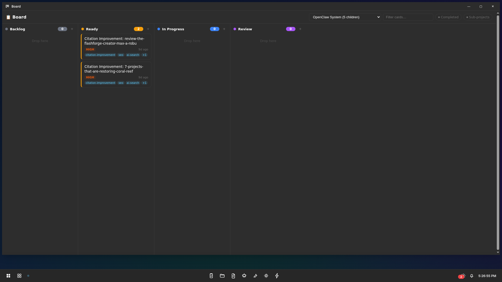
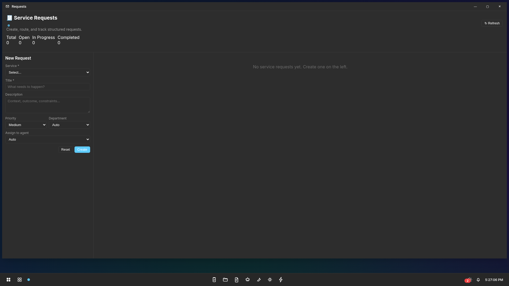
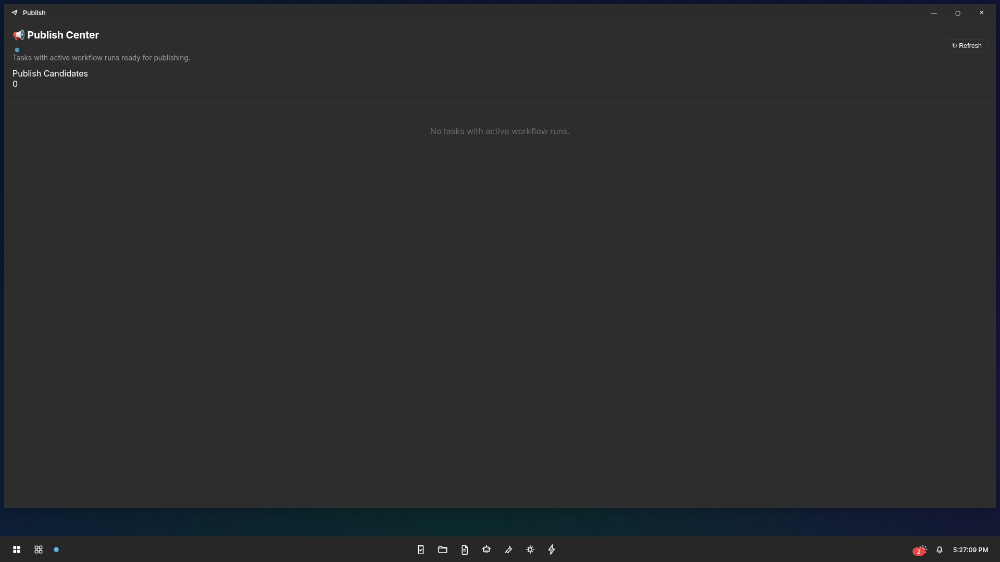
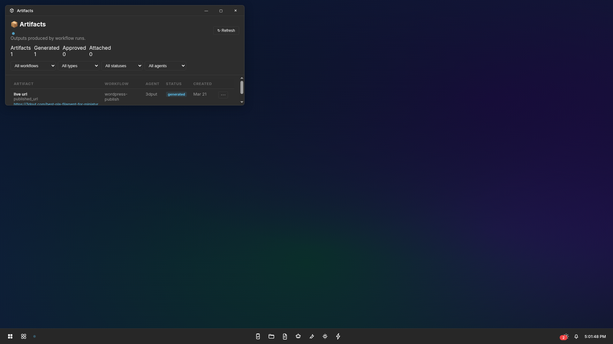
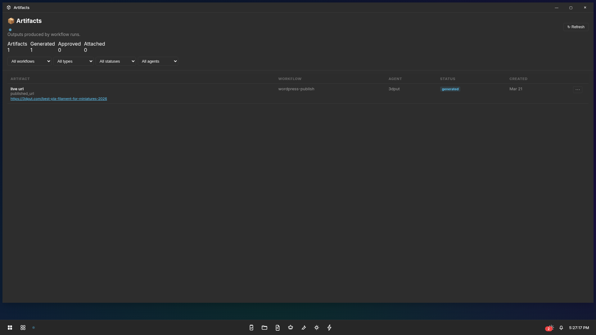
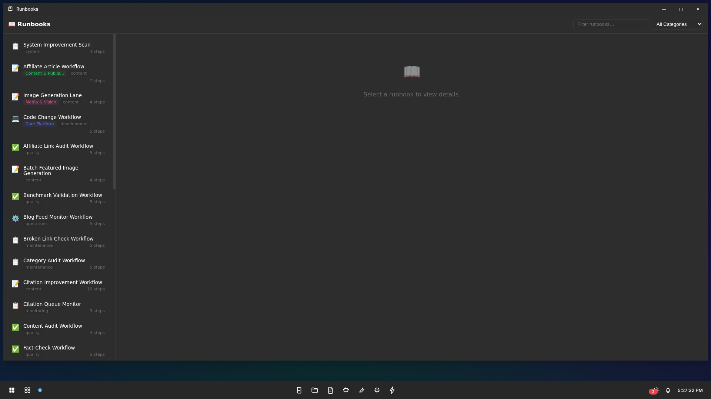
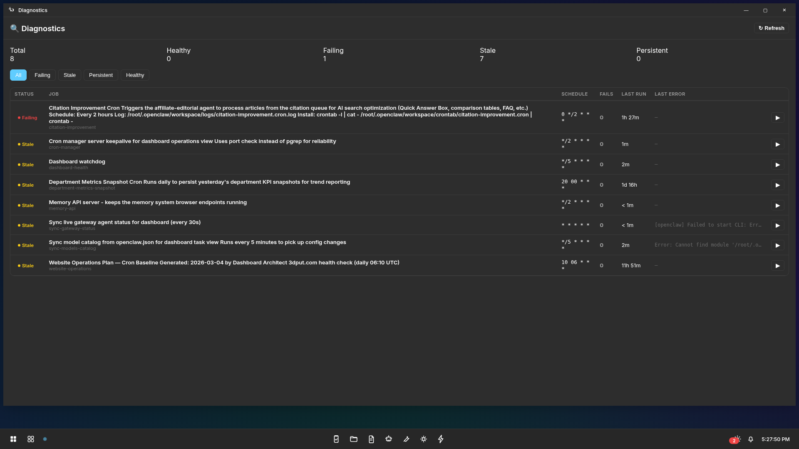
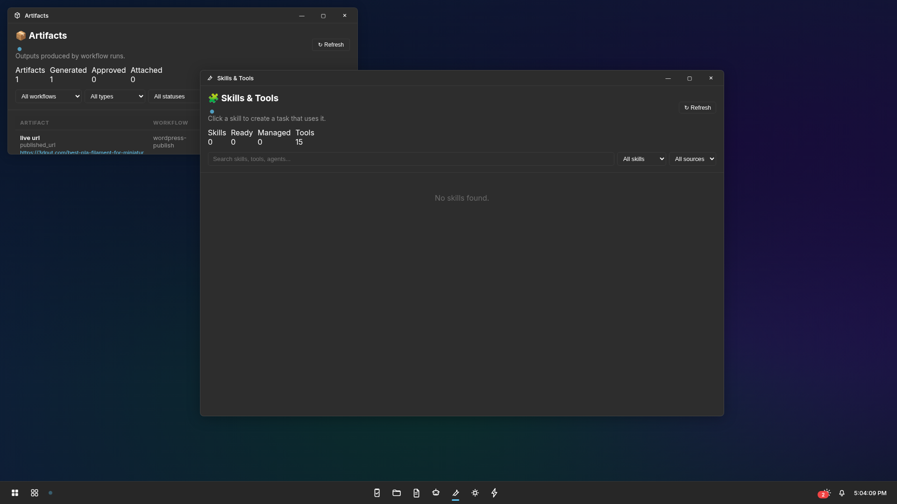
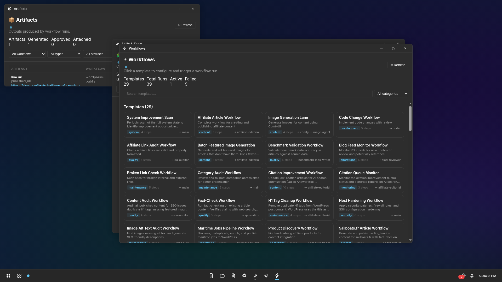
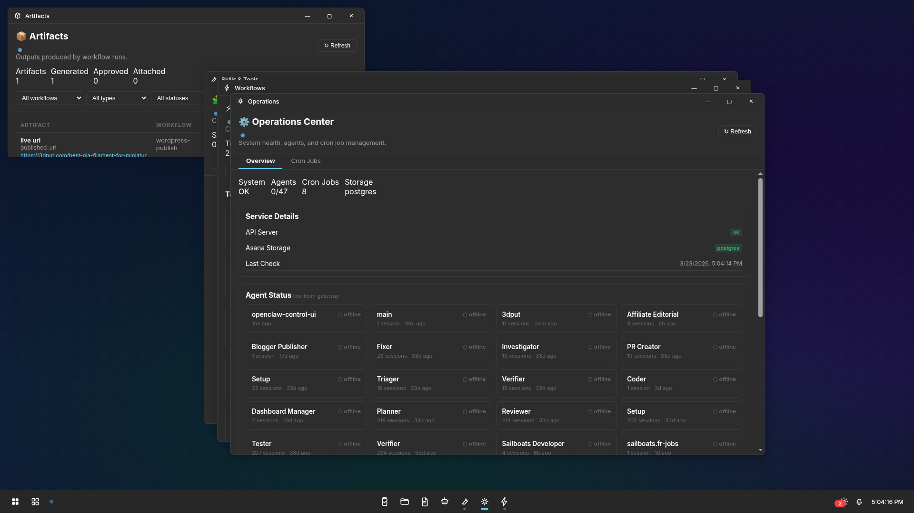

# OpenClaw Project WebOS

`2.0.0`

A Windows 11-style desktop environment for managing OpenClaw agent workflows — served entirely in the browser with vanilla JS, no frameworks, no build step. Each feature is a windowed application launched from the taskbar or start menu.

## Screenshots

### Desktop

<p align="center">
  
</p>

### Work

| Tasks | Board | Timeline | Agents |
|:-----:|:-----:|:--------:|:------:|
|  |  |  |  |

| Requests | Publish | Approvals | Artifacts |
|:--------:|:-------:|:---------:|:---------:|
|  |  |  |  |

### Operations

| Dependencies | Health | Metrics | Runbooks |
|:------------:|:------:|:-------:|:--------:|
|  |  |  |  |

| Memory | Handoffs | Audit | Cron |
|:------:|:--------:|:-----:|:----:|
|  |  |  |  |

### System

| Diagnostics | Departments | Explorer | Notepad |
|:-----------:|:-----------:|:--------:|:-------:|
|  |  |  |  |

### Integration

| Skills & Tools | Workflows | Operations |
|:--------------:|:---------:|:----------:|
|  |  |  |

## Features

### Desktop Shell
- **Windows 11 aesthetic** — frosted glass taskbar, start menu with app grid, draggable/resizable windows
- **36 windowed apps** — each feature is a self-contained view launched as a desktop window
- **19 desktop widgets** — always-on data panels (clock, health, task pulse, agent fleet, etc.)
- **Start menu** — searchable app grid organized by category (Work, Operations, System, Integration)
- **Taskbar** — live clock, system tray, running app indicators, theme toggle
- **Offline support** — IndexedDB-backed state management with automatic sync on reconnect

### Explorer
File explorer window for browsing the OpenClaw workspace directly from the desktop. Features:

- **Quick-access roots** — one-click navigation to Backend, Dashboard, Extensions, Agents, and Docs directories
- **Breadcrumb navigation** — click any path segment to jump up the tree
- **File listing** — shows name, size, and modified time with folder/file icon differentiation
- **Directory browsing** — click any folder to descend; click breadcrumbs to ascend
- **Notepad integration** — double-click a file to open it in the Notepad app via the `notepad:open-file` event bridge
- **Filesystem API backend** — connects to `/api/fs` endpoint with path traversal protection and CORS support

### Notepad
Lightweight text editor window for viewing and editing files from the Explorer or standalone. Features:

- **File open from Explorer** — Explorer dispatches `notepad:open-file` events; Notepad listens and loads the content
- **Direct path input** — open any workspace file by typing its path
- **State bridge** — supports `stateStore.setState()` for cross-view communication

### Task Management
- **Hierarchical boards** — parent/child project boards with folder-style navigation
- **Kanban board** — drag-and-drop columns (Ready, In Progress, Review, Completed)
- **Rich task composer** — agent assignment, preferred LLM model, priority, recurrence, start/due dates
- **Timeline view** — Gantt-style visualization of task scheduling and dependencies
- **Agent queue visibility** — live status of what each agent is working on

### Workflow Engine
- **Workflow dispatcher v2** — database-first dispatch with agent routing, concurrency limits, and stale recovery
- **Agent workflow client** — CLI for agents to poll, claim, heartbeat, and complete runs
- **Governance system** — role-based action authorization for operators
- **Runbook execution** — pre-defined operational procedures that agents can follow

### Observability
- **Agent dashboard** — live OpenClaw agent status, queue presence, per-agent detail
- **Health monitoring** — service health checks with status indicators
- **Metrics** — department-level and project-level metrics with sparkline widgets
- **Audit trail** — full audit log of actions, approvals, and state changes
- **Cron management** — view and manage scheduled jobs across the system
- **Diagnostics** — System Operations Center for cron failures, skill issues, and repair actions

### Organization
- **Departments** — organizational modeling with agent-to-department mapping
- **Service catalog** — available automation services with workflow template linking
- **Service requests** — business request intake with automatic routing to workflows

---

## Documentation Index

> **Read online:** all documentation below is published as a website at **https://pgedeon.github.io/openclaw-project-webos/** (GitHub Pages, deployed automatically from `docs/` on every push to main).

### Getting Started

| Document | Description |
|----------|-------------|
| [Install (OpenClaw workspace)](docs/install-openclaw.md) | Install as part of an existing OpenClaw setup |
| [Install (Standalone)](docs/install-standalone.md) | Install independently without OpenClaw |
| [Development Guide](docs/development.md) | Local development setup and workflow |
| [Configuration Reference](docs/configuration-reference.md) | All environment variables, ports, and server bindings |

### User Documentation

| Document | Description |
|----------|-------------|
| [User Guide](docs/user-guide.md) | Desktop usage — tasks, board, timeline, agents, audit, cron |
| [Views Reference](docs/views-reference.md) | All 31 desktop views — features, API calls, UI elements |
| [Widget Catalog](docs/widget-catalog.md) | All 19 desktop widgets — manifests, sizes, data sources |
| [Admin Guide](docs/admin-guide.md) | Operator guide for administration and monitoring |

### API Reference

| Document | Description |
|----------|-------------|
| [Core API](docs/api.md) | Task CRUD, projects, agents, dependencies |
| [Complete API Reference](docs/api-reference-complete.md) | All supplementary APIs — services, catalog, org, metrics, diagnostics, governance, filesystem, memory, cron |
| [Auth Reference](docs/auth-reference.md) | Current bearer-token mode and deferred full-auth policy |

### Architecture & Internals

| Document | Description |
|----------|-------------|
| [Shell Architecture](docs/shell-architecture.md) | Desktop shell internals — window manager, taskbar, start menu, realtime sync, API client, view system |
| [Widget System](docs/WIDGET-SYSTEM.md) | Widget architecture and how to create custom widgets |
| [Offline Support](docs/offline-reference.md) | IndexedDB, state manager, sync manager, conflict resolution |
| [Storage Layer](docs/storage-reference.md) | PostgreSQL storage layer — CRUD operations, dependency management, security |
| [Database Schema](docs/schema-reference.md) | Complete schema reference with all 21 migrations |
| [Dispatcher & Monitor](docs/dispatcher-monitor-reference.md) | Workflow dispatcher v2, run monitor, agent client, governance, sync modules |
| [Dispatcher V2 Design](docs/DISPATCHER_V2_DESIGN.md) | Design document for the database-first dispatcher |

### Workflow & Agent Integration

| Document | Description |
|----------|-------------|
| [Agent Integration](docs/AGENT_INTEGRATION.md) | How agents report tasks and interact with the dashboard |
| [Workflow Integration Guide](WORKFLOW_INTEGRATION_GUIDE.md) | End-to-end workflow setup and configuration |
| [Workflow README](WORKFLOW_README.md) | Workflow system overview |

### Operations

| Document | Description |
|----------|-------------|
| [Scripts Reference](docs/scripts-reference.md) | All operational scripts — health, validation, restart, sync, migration |
| [Developer Guide](DEVELOPER_GUIDE.md) | Contributing guidelines and architecture notes |
| [Remote Access](docs/remote-access.md) | Tailnet recipe for off-LAN dashboard access; topology constraints and security notes |

### Implementation Details

| Document | Description |
|----------|-------------|
| [File Explorer & Notepad](docs/file-explorer-notepad-implementation.md) | Implementation notes for the explorer and notepad views |

### Release

| Document | Description |
|----------|-------------|
| [Release Notes](RELEASE.md) | Current release notes |
| [Changelog](CHANGELOG.md) | Full change history |

---

## Install

Two install modes:

- **OpenClaw workspace install:** [docs/install-openclaw.md](docs/install-openclaw.md)
- **Standalone install:** [docs/install-standalone.md](docs/install-standalone.md)

Quick start (OpenClaw workspace):

```bash
git clone https://github.com/pgedeon/openclaw-project-webos.git ~/.openclaw/workspace/dashboard
cd ~/.openclaw/workspace/dashboard
npm install
cp .env.example .env
psql -U openclaw -d openclaw_dashboard -f schema/openclaw-dashboard.sql
npm start
```

When installed at `~/.openclaw/workspace/dashboard`, the server auto-detects the workspace path. Set `OPENCLAW_WORKSPACE` and `OPENCLAW_CONFIG_FILE` if installing elsewhere.

---

## Repository Layout

```
├── index.html                       # Desktop shell entry point
├── task-server.js                   # Main API server (port 3876)
├── cron-manager-server.mjs          # Cron management API (port 3878)
├── memory-api-server.mjs            # Memory system API (port 3879)
├── filesystem-api-server.mjs        # Filesystem browser API (port 3880)
├── gateway-workflow-dispatcher-v2.js # Async workflow dispatcher
├── workflow-run-monitor.js          # Stale/orphan run recovery
├── agent-workflow-client.js         # Agent CLI for workflow interaction
├── governance.js                    # Role-based action authorization
├── org-bootstrap.js                 # Department/agent seed data
├── sync-gateway-status.mjs          # Gateway agent status sync
├── sync-models-catalog.js           # Model catalog sync
│
├── storage/
│   └── asana.js                     # PostgreSQL storage layer
│
├── src/
│   ├── shell/
│   │   ├── shell-main.mjs           # Desktop shell bootstrap
│   │   ├── app-registry.mjs         # 23-app window registry
│   │   ├── window-manager.mjs       # Draggable/resizable windows
│   │   ├── taskbar.mjs              # Bottom taskbar + system tray
│   │   ├── start-menu.mjs           # App launcher with search
│   │   ├── api-client.mjs           # HTTP client abstraction
│   │   ├── realtime-sync.mjs        # 20s polling data sync
│   │   ├── view-adapter.mjs         # View-to-window bridge
│   │   ├── view-state.mjs           # Reactive per-view state
│   │   ├── widgets/                 # Desktop widget system
│   │   │   ├── widget-registry.mjs  # Widget auto-discovery
│   │   │   ├── widget-panel.mjs     # Widget panel container
│   │   │   └── widgets/             # 19 widget implementations
│   │   └── native-views/            # 23 window view implementations
│   │       ├── tasks-view.mjs
│   │       ├── board-view.mjs
│   │       ├── agents-view.mjs
│   │       ├── explorer-view.mjs
│   │       ├── notepad-view.mjs
│   │       └── ...
│   ├── styles/                      # Win11-themed CSS
│   └── offline/                     # IndexedDB offline layer
│       ├── idb.mjs                  # IndexedDB wrapper
│       ├── state-manager.mjs        # State management + persistence
│       ├── sync-manager.mjs         # Mutation queue + background sync
│       └── offline-ui.mjs           # Status indicators + error banners
│
├── schema/
│   ├── openclaw-dashboard.sql       # Base schema
│   └── migrations/                  # 21 incremental migrations
│
├── scripts/
│   ├── dashboard-health.sh          # Health monitor + auto-restart
│   ├── dashboard-validation.js      # API validation test suite
│   ├── restart-task-server.sh       # Safe server restart
│   ├── smoke-test-dashboard.sh      # End-to-end smoke tests
│   ├── aggregate-department-metrics.js
│   ├── sync-openclaw-projects.mjs
│   └── system-improvement-engine.py
│
├── docs/                            # Documentation hub
│   ├── admin-guide.md
│   ├── api.md
│   ├── api-reference-complete.md
│   ├── configuration-reference.md
│   ├── development.md
│   ├── dispatcher-monitor-reference.md
│   ├── install-openclaw.md
│   ├── install-standalone.md
│   ├── offline-reference.md
│   ├── schema-reference.md
│   ├── scripts-reference.md
│   ├── shell-architecture.md
│   ├── storage-reference.md
│   ├── user-guide.md
│   ├── views-reference.md
│   ├── widget-catalog.md
│   └── screenshots/all-windows/
│
├── runbooks/                        # Operational runbook definitions
├── tests/                           # Unit + integration tests
├── .env.example                     # Environment variable template
├── DEVELOPER_GUIDE.md               # Contributing guide
├── WORKFLOW_INTEGRATION_GUIDE.md    # Workflow setup guide
├── WORKFLOW_README.md               # Workflow system overview
├── RELEASE.md                       # Release notes
└── CHANGELOG.md                     # Change history
```

---

## Server Architecture

Four HTTP servers run alongside each other:

| Port | Server | Binding | Purpose |
|------|--------|---------|---------|
| `3876` | `task-server.js` | `0.0.0.0` | Main API + desktop shell + static assets |
| `3878` | `cron-manager-server.mjs` | `127.0.0.1` | Cron job CRUD + execution |
| `3879` | `memory-api-server.mjs` | `127.0.0.1` | Memory files + semantic search |
| `3880` | `filesystem-api-server.mjs` | `127.0.0.1` | Workspace file browser |

Two background processes handle workflow execution:

- **Dispatcher V2** — polls for queued workflow runs and dispatches to agents
- **Workflow Run Monitor** — detects orphaned and stale runs, spawns recovery agents

See [dispatcher-monitor-reference.md](docs/dispatcher-monitor-reference.md) for details.

---

## Configuration

See [configuration-reference.md](docs/configuration-reference.md) for all environment variables.

Key variables:
- `PORT` — main server port (default `3876`)
- `STORAGE_TYPE` — `postgres` or `json_snapshot`
- `POSTGRES_HOST` / `POSTGRES_PORT` / `POSTGRES_DB` / `POSTGRES_USER` / `POSTGRES_PASSWORD`
- `OPENCLAW_WORKSPACE` — path to OpenClaw workspace root
- `OPENCLAW_CONFIG_FILE` — path to `openclaw.json`
- `FILESYSTEM_API_PORT` — filesystem API port (default `3880`)

---

## Development

```bash
npm install
npm run validate
```

Point validation at a custom port:
```bash
DASHBOARD_API_BASE=http://localhost:3887 node scripts/dashboard-validation.js
```

---

## Release

Tagged as `v2.0.0` on [github.com/pgedeon/openclaw-project-webos](https://github.com/pgedeon/openclaw-project-webos).

- Release notes: [RELEASE.md](RELEASE.md)
- Change history: [CHANGELOG.md](CHANGELOG.md)

## License

MIT. See [LICENSE](LICENSE).

---

[](https://www.paypal.com/donate/?business=petermgedeon%40gmail.com)
